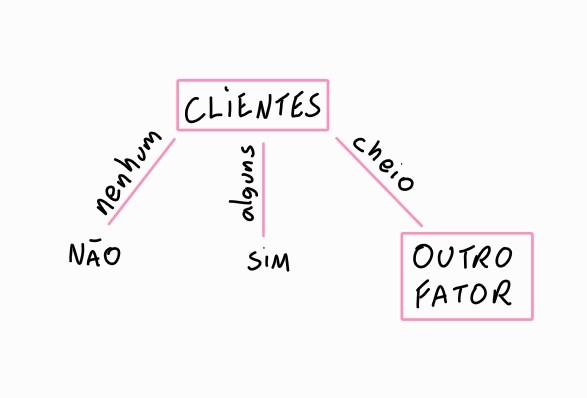

# 🌳 Como gerar uma Árvore de Decisão (AD)?

## 🍽️ Exemplo Restaurante

O algoritmo precisa aprender a responder:

> “Devemos esperar por uma mesa neste restaurante?”

A resposta que queremos prever é chamada de **classe**:
- **Sim**: vamos esperar.
- **Não**: não vamos esperar.

Para tomar essa decisão, o algoritmo recebe informações como:
- Existe outro restaurante próximo?
- Há um bar confortável?
- Estamos com fome?
- Quantos clientes estão no restaurante?
- Está chovendo?
- Temos reserva?
- Qual é o tipo do restaurante?
- Qual é o tempo estimado de espera?

Cada linha da tabela é uma experiência anterior.

### Tabela

| Alternativo | Bar | Sex/Sáb | Fome | Clientes | Preço | Chuva | Reserva | Tipo | Tempo | Vai esperar? |
|---|---|---|---|---|---|---|---|---|---|---|
| Sim | Não | Não | Sim | Alguns | RRR | Não | Sim | Francês | 0-10 | Sim |
| Sim | Não | Não | Sim | Cheio | R | Não | Não | Tailandês | 30-60 | Não |
| Não | Sim | Não | Não | Alguns | R | Não | Não | Hambúrguer | 0-10 | Sim |
| Sim | Não | Sim | Sim | Cheio | R | Sim | Não | Tailandês | 10-30 | Sim |
| Sim | Não | Sim | Não | Cheio | RRR | Não | Sim | Francês | >60 | Não |
| Não | Sim | Não | Sim | Alguns | RR | Sim | Sim | Italiano | 0-10 | Sim |
| Não | Sim | Não | Não | Nenhum | R | Sim | Não | Hambúrguer | 0-10 | Não |
| Não | Não | Não | Sim | Alguns | RR | Sim | Sim | Tailandês | 0-10 | Sim |
| Não | Sim | Sim | Não | Cheio | R | Sim | Não | Hambúrguer | >60 | Não |
| Sim | Sim | Sim | Sim | Cheio | RRR | Não | Sim | Italiano | 10-30 | Não |
| Não | Não | Não | Não | Nenhum | R | Não | Não | Tailandês | 0-10 | Não |
| Sim | Sim | Sim | Sim | Cheio | R | Não | Não | Hambúrguer | 30-60 | Sim |

> No exemplo 1, havia alguns clientes, o restaurante era francês, o tempo era de 0–10 minutos e a pessoa decidiu esperar.

## Como funciona a AD?

> A última coluna "vai esperar?" é a nossa classe, e nesse exemplo vamos analisar o atributo "clientes".

Temos que pensar o seguinte:

1. Quantas e quais são nossas opções na coluna analisada (clientes)?

2. De cada uma dessas opções, quais estão "sim" e quais estão "não" na classe (vai esperar?)?

| Nenhum | Alguns | Cheio |
|---|---|---|
| Sim: 0 | Sim: 4 | Sim: 2 |
| Não: 2 | Não: 0 | Não: 4 |

Quando o restaurante estava cheio, 2 pessoas esperaram e 4 não esperaram.  
Quando algum caso dê 0, significa que chegamos em uma folha da ávore, pois só existe uma opção.  

- **Raiz:** primeira pergunta da árvore.
- **Nó interno:** outra pergunta.

## A principal dificuldade

Não basta escolher qualquer atributo para ser a raiz.  
Precisamos escolher o atributo que **melhor separa os exemplos positivos e negativos.**

### Exemplo: “Tipo” é um atributo ruim
Se começarmos perguntando o tipo do restaurante, teremos:

| Francês | Italiano | Tailandês | Hambúrguer |
|---|---|---|---|
| Sim: 1 | Sim: 1 | Sim: 2 | Sim: 2 |
| Não: 1 | Não: 1 | Não: 2 | Não: 2 |

Todos os grupos continuam igualmente misturados. Portanto, o atributo Tipo não **trouxe informação útil.**  
Ele dividiu os exemplos, mas não facilitou a classificação.

> Uma boa divisão não é necessariamente a que cria mais grupos. É a que cria grupos mais folhas.

# Próxima Página ➡️

[Como gerar](https://github.com/anemadjarian/IA/tree/main/Resumos/%C3%81rvore%20de%20Decis%C3%A3o/Como%20gerar)
