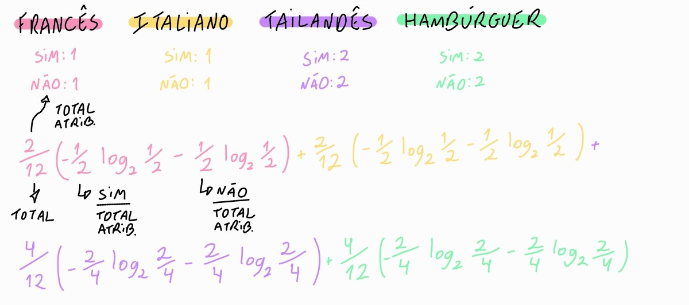

# Como medir matematicamente essa qualidade?

A medida mais comum é a entropia.  

Ela representa o nível de mistura ou incerteza de um conjunto:

- **Entropia 0:** grupo completamente puro (uma folha).
- **Entropia alta:** positivos e negativos misturados.

O cálculo de entropia consiste no somatório do: total daquele atributo / pelo total da de casos (linhas na tabela) * (- total de casos positivos / total daquele atributo * log na base 2 (total de casos positivos / total daquele atributo) - total de casos negativos total daquele atributo * log na base 2 (total de casos negativo / total daquele atributo))

Ganho = E(classe) - E(atributo)

## Ganho do atributo “Tipo”

Ganho = 1-1 = 0

> Isso confirma matematicamente a análise anterior, saber o tipo do restaurante não reduziu nossa incerteza.

## Ganho do atributo “Clientes”