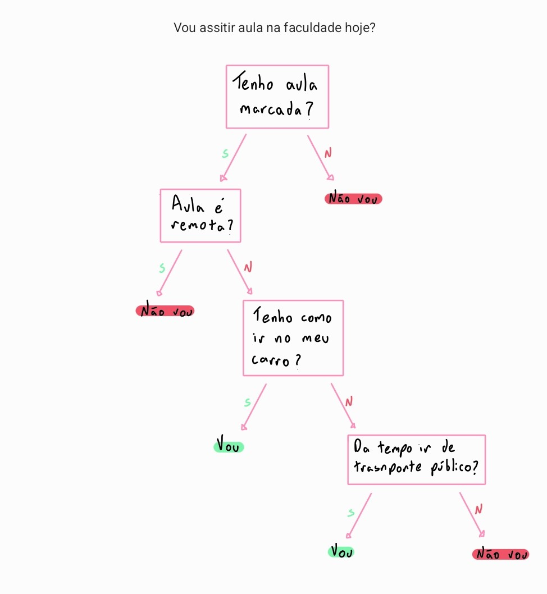
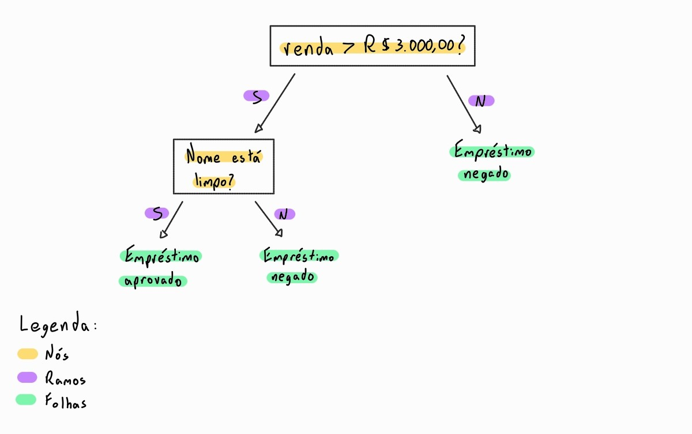

# 🌳 O que é uma Árvore de Decisão (AD)?

É um modelo de aprendizado de máquina que toma decisões por meio de uma **sequência hierárquica** de perguntas. Cada resposta conduz a um **novo caminho** até chegar a uma **decisão final**.

É bastante usada pois:
- possui funcionamento simples;
- é fácil de interpretar;
- permite visualizar o processo de decisão;
- gera regras compreensíveis por pessoas.

## 🧠 Classificação vs. Regressão

Uma AD pode ser denominada de dois tipos:
- **Árvore de classificação:** prevê uma categoria ou classe, exemplo: "aprovado" ou "reprovado";
- **Árvore de regressão:** prevê um valor numérico, exemplo: preço ou temperatura.

## 🏗️ Estrutura da AD

- **Nós:** representam testes realizados sobre uma variável ou atributo.
- **Ramos:** representam os possíveis resultados desses testes.
- **Folhas:** apresentam a classificação ou previsão final.

### 📝 Exemplo

📌 Um caminho completo seria: Se a renda é maior que R$ 3.000 e o nome está limpo, então o empréstimo é aprovado.

## Principais Algoritmos

Ano | Algoritmo | Característica |
|:-------:|:----------:|:----------:|
1966 | CLS-Early | Algoritmo inicial para construção de árvores
1976 | ID3 | Classificação baseada em teoria da informação
1984 | CART | Árvores de classificação e regressão
1993 | C4.5 |Evolução e melhoria do ID3